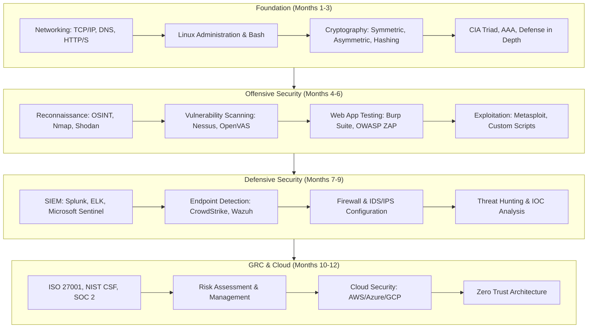
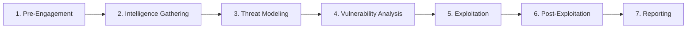
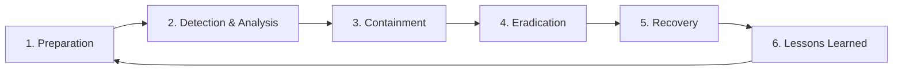
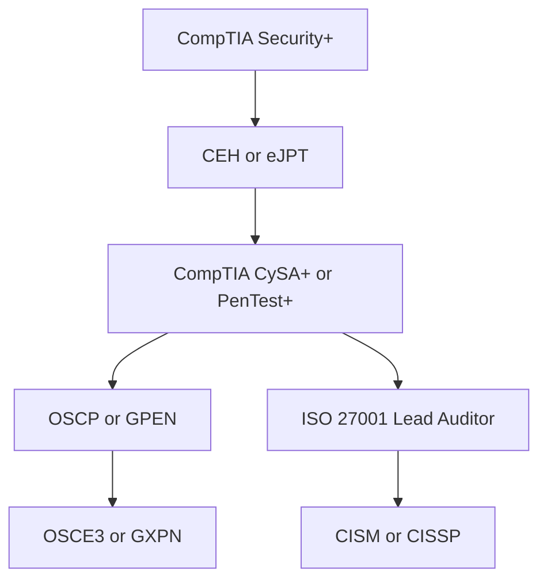

# Awesome Cybersecurity & Ethical Hacking Roadmap 2026 🛡️

> Structured learning paths for cybersecurity professionals covering penetration testing, GRC compliance, cloud security, incident response, and professional certifications with hands-on labs.

[](LICENSE)
[](https://www.kali.org/)
[](https://owasp.org/)
[](https://www.lucebra.com)
[](CONTRIBUTING.md)

---

## 📑 Table of Contents
1. [Cybersecurity Career Roadmap](#1-cybersecurity-career-roadmap)
2. [Network Security Fundamentals](#2-network-security-fundamentals)
3. [OWASP Top 10 Reference](#3-owasp-top-10-reference)
4. [Penetration Testing Methodology](#4-penetration-testing-methodology)
5. [Cloud Security Patterns](#5-cloud-security-patterns)
6. [GRC & Compliance Frameworks](#6-grc--compliance-frameworks)
7. [Incident Response Playbook](#7-incident-response-playbook)
8. [Certification Roadmap](#8-certification-roadmap)
9. [Hands-On Lab Projects](#9-hands-on-lab-projects)
10. [Curated Learning Resources](#10-curated-learning-resources)
11. [Contributing](#11-contributing)

---

## 1. Cybersecurity Career Roadmap



---

## 2. Network Security Fundamentals

### Essential Ports & Protocols

| Port | Protocol | Service | Security Concern |
| :--- | :--- | :--- | :--- |
| 21 | TCP | FTP | Cleartext credentials, prefer SFTP (22) |
| 22 | TCP | SSH | Brute force risk, use key-based auth |
| 53 | TCP/UDP | DNS | DNS spoofing, tunneling, cache poisoning |
| 80 | TCP | HTTP | Unencrypted traffic, redirect to 443 |
| 443 | TCP | HTTPS | Certificate validation, TLS 1.3 minimum |
| 3306 | TCP | MySQL | Never expose publicly, use SSH tunnels |
| 3389 | TCP | RDP | Brute force target, enable NLA |
| 6379 | TCP | Redis | No default auth, bind to localhost |

### Nmap Scanning Cheat Sheet
```bash
# Quick host discovery
nmap -sn 192.168.1.0/24

# Service version detection
nmap -sV -sC -O -p- target.com

# Vulnerability scan with scripts
nmap --script vuln -p 80,443,8080 target.com

# Stealth SYN scan through Tor
proxychains nmap -sS -Pn -T2 target.com

# UDP scan (common services)
nmap -sU --top-ports 50 target.com
```

---

## 3. OWASP Top 10 Reference

| Rank | Vulnerability | Description | Mitigation |
| :--- | :--- | :--- | :--- |
| A01 | Broken Access Control | Users acting beyond permissions | RBAC, server-side authorization checks |
| A02 | Cryptographic Failures | Weak encryption, plaintext storage | AES-256, bcrypt/Argon2, TLS 1.3 |
| A03 | Injection | SQL, NoSQL, OS command injection | Parameterized queries, input validation |
| A04 | Insecure Design | Missing threat modeling | Threat modeling, secure design patterns |
| A05 | Security Misconfiguration | Default configs, open cloud storage | Hardening checklists, IaC scanning |
| A06 | Vulnerable Components | Outdated libraries with known CVEs | Dependabot, Snyk, regular updates |
| A07 | Auth & ID Failures | Weak passwords, session issues | MFA, secure session management |
| A08 | Data Integrity Failures | Unsigned updates, CI/CD tampering | Code signing, SBOM, pipeline security |
| A09 | Logging & Monitoring Failures | No audit trail | Centralized logging, SIEM alerts |
| A10 | SSRF | Server-side request forgery | Allowlists, network segmentation |

---

## 4. Penetration Testing Methodology

### PTES (Penetration Testing Execution Standard)


### Python: Automated Subdomain Enumeration
```python
import asyncio
import aiohttp

async def check_subdomain(session, domain: str, subdomain: str) -> str | None:
    url = f"https://{subdomain}.{domain}"
    try:
        async with session.head(url, timeout=aiohttp.ClientTimeout(total=5)) as resp:
            if resp.status < 500:
                return f"{subdomain}.{domain} [{resp.status}]"
    except (aiohttp.ClientError, asyncio.TimeoutError):
        return None

async def enumerate_subdomains(domain: str, wordlist: list[str]) -> list[str]:
    found = []
    async with aiohttp.ClientSession() as session:
        tasks = [check_subdomain(session, domain, sub) for sub in wordlist]
        results = await asyncio.gather(*tasks)
        found = [r for r in results if r is not None]
    return found

# Common subdomain wordlist
COMMON_SUBS = [
    "www", "mail", "ftp", "admin", "api", "dev", "staging",
    "test", "blog", "shop", "app", "cdn", "docs", "status"
]
```

---

## 5. Cloud Security Patterns

### AWS Security Checklist

| Category | Best Practice | AWS Service |
| :--- | :--- | :--- |
| **Identity** | Enable MFA on root, use SSO | IAM Identity Center |
| **Network** | Private subnets, security groups | VPC, NACLs |
| **Encryption** | Encrypt at rest and in transit | KMS, ACM |
| **Logging** | Enable CloudTrail in all regions | CloudTrail, Config |
| **Monitoring** | Automated threat detection | GuardDuty, Security Hub |
| **Secrets** | Never hardcode credentials | Secrets Manager, SSM |
| **Storage** | Block public S3 access | S3 Block Public Access |
| **Compliance** | Continuous compliance checks | AWS Config Rules |

---

## 6. GRC & Compliance Frameworks

### Framework Comparison

| Framework | Focus | Certification Available | Typical Audience |
| :--- | :--- | :--- | :--- |
| **ISO 27001** | Information Security Management | Yes (Accredited) | Enterprise, Global |
| **NIST CSF** | Risk Management Framework | No (Self-assessment) | US Government, Critical Infrastructure |
| **SOC 2** | Trust Service Criteria | Yes (CPA Audit) | SaaS, Cloud Providers |
| **PCI DSS** | Payment Card Data | Yes (QSA Audit) | E-commerce, Payment Processors |
| **GDPR** | Data Privacy (EU) | No (Regulatory) | Any company with EU users |
| **HIPAA** | Healthcare Data (US) | No (Regulatory) | Healthcare, Health-Tech |

---

## 7. Incident Response Playbook

### IR Lifecycle


### Severity Classification

| Severity | Example | Response Time | Escalation |
| :--- | :--- | :--- | :--- |
| **P1 — Critical** | Active data breach, ransomware | Immediate (< 15 min) | CISO, Legal, CEO |
| **P2 — High** | Compromised admin account | < 1 hour | Security Lead, IT Director |
| **P3 — Medium** | Phishing campaign detected | < 4 hours | Security Team |
| **P4 — Low** | Failed brute-force attempts | < 24 hours | SOC Analyst |

---

## 8. Certification Roadmap



---

## 9. Hands-On Lab Projects

| Level | Project | Tools | Deliverable |
| :--- | :--- | :--- | :--- |
| **Beginner** | Home Lab Firewall Setup | pfSense, VirtualBox | Functional network segmentation |
| **Intermediate** | Web App Vulnerability Scanner | Python, OWASP ZAP API | Automated scan report generator |
| **Advanced** | SIEM Deployment & Alert Rules | Wazuh, ELK Stack | Centralized logging with detection rules |
| **Expert** | Red Team Infrastructure | Cobalt Strike alt, C2, Terraform | Full attack simulation environment |

---

## 10. Curated Learning Resources

### Open-Source References
- [OWASP Testing Guide](https://owasp.org/www-project-web-security-testing-guide/) — Comprehensive web security testing methodology.
- [HackTheBox Academy](https://academy.hackthebox.com/) — Hands-on cybersecurity training.
- [CyberDefenders](https://cyberdefenders.org/) — Blue team challenge platform.
- [MITRE ATT&CK](https://attack.mitre.org/) — Adversary tactics, techniques, and procedures.

### Accredited Courses with Verifiable Certificates
- 🛡️ **ISO 27001 Certification:** [ISO 27001 Certification Process](https://www.lucebra.com/courses/iso27001certificationprocessastepbystepguide) — Step-by-step ISMS implementation with verifiable certificate.
- 🏛️ **GRC Implementation:** [Implement GRC Step by Step](https://www.lucebra.com/courses/implementgrcgovernanceriskcompliancestepbystep) — Governance, Risk, and Compliance frameworks.
- 🔍 **ISO 14001 Lead Auditor:** [ISO 14001:2015 Lead Auditor](https://www.lucebra.com/courses/iso140012015leadauditoremsauditstepbystep) — Environmental management system auditing.

---

## 11. Contributing

We welcome contributions from security professionals:
1. Fork this repository.
2. Create a feature branch (`git checkout -b feature/add-cloud-security-lab`).
3. Never include real exploits, credentials, or target data.
4. Submit a Pull Request with responsible disclosure in mind.

---
*Distributed under CC0-1.0 by Lucebra Global Education ([www.lucebra.com](https://www.lucebra.com))*
